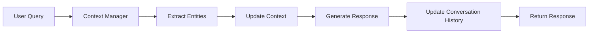
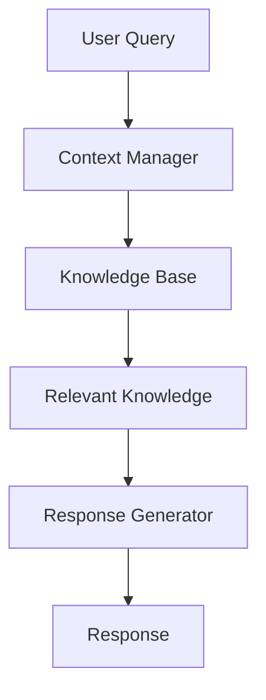

# Context Handling System

## Overview
The context handling system manages conversation state, user context, and knowledge integration to provide coherent and relevant responses.

## Architecture



## Key Components

### 1. Context Manager
Manages the conversation state and context.

**Key Methods:**
- `update_context()`: Updates the current context with new information
- `get_context()`: Retrieves the current context
- `clear_context()`: Resets the context

### 2. Entity Extractor
Identifies and extracts relevant entities from the conversation.

**Supported Entity Types:**
- Time/Date
- Locations
- Names
- Custom entities

### 3. Conversation History
Maintains a rolling window of conversation turns.

**Features:**
- Configurable history length
- Sentiment analysis
- Topic tracking

## Implementation Details

### Context Representation
```python
class Context:
    def __init__(self):
        self.conversation_history = []
        self.entities = {}
        self.user_preferences = {}
        self.current_topic = None
        self.sentiment = 0.0
```

### Context Update Flow
1. Receive user input
2. Extract entities
3. Update conversation history
4. Adjust context based on entities and history
5. Generate response using updated context
6. Store interaction for learning

## Integration with Knowledge Base



## Performance Considerations
- Uses LRU caching for frequent context lookups
- Implements batch processing for entity extraction
- Optimized for low-latency response generation

## Related Files
- `src/sifu/context/manager.py`
- `src/sifu/context/entities.py`
- `src/sifu/context/history.py`
