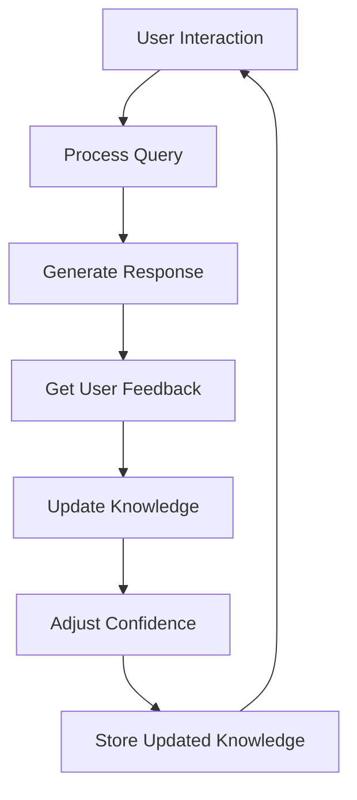
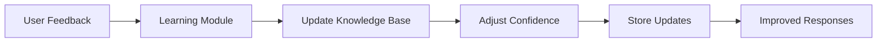

# Real-time Learning Loop

## Overview
Implements continuous learning from user interactions and feedback to improve response quality over time.

## Architecture

## Key Components

### 1. Feedback Collection
- Explicit feedback (thumbs up/down)
- Implicit feedback (user rephrasing, follow-up questions)
- Response quality metrics

### 2. Knowledge Update
- Confidence-based updates
- Versioning of knowledge entries
- Conflict resolution

### 3. Model Retraining
- Periodic retraining of ML models
- A/B testing of different responses
- Performance monitoring

## Implementation Details

### Learning Loop Flow
1. Process user query and generate response
2. Collect explicit or implicit feedback
3. Calculate learning signal
4. Update knowledge base
5. Adjust model parameters if needed

### Confidence Management
- Starts with lower confidence for new knowledge
- Increases with positive feedback
- Decreases with negative feedback
- Decays over time without reinforcement

## Integration with Knowledge Base

## Performance Considerations
- Implements batch updates for efficiency
- Uses incremental learning where possible
- Implements rate limiting for resource-intensive operations

## Related Files
- `src/sifu/learning/feedback.py`
- `src/sifu/learning/updater.py`
- `src/sifu/learning/confidence.py`
