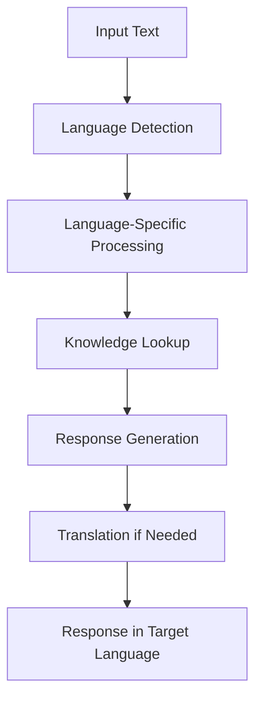
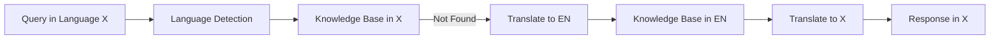

# Multi-language Support

## Overview
Provides comprehensive support for multiple languages in the knowledge base and response generation.

## Architecture



## Key Components

### 1. Language Detection
- Fast language identification
- Confidence scoring
- Fallback mechanisms

### 2. Translation Layer
- On-demand translation
- Caching of frequent translations
- Support for multiple translation backends

### 3. Culture-Specific Responses
- Localization of dates, numbers, units
- Cultural context awareness
- Region-specific knowledge

## Implementation Details

### Language Representation
```python
class LanguageConfig:
    def __init__(self, code, name, rtl=False, locale=None):
        self.code = code  # ISO 639-1 code
        self.name = name  # Language name
        self.rtl = rtl    # Right-to-left script
        self.locale = locale or code  # Locale code
        self.supported = True  # Whether fully supported
```

### Processing Pipeline
1. Detect input language
2. Process in native language when possible
3. Use translation for unsupported languages
4. Generate culturally appropriate response
5. Translate back if needed

### Performance Optimization
- Caches translations
- Uses efficient language detection algorithms
- Implements batch processing for multiple languages

## Integration with Knowledge Base



## Related Files
- `src/sifu/language/detector.py`
- `src/sifu/language/translator.py`
- `src/sifu/language/locale.py`
