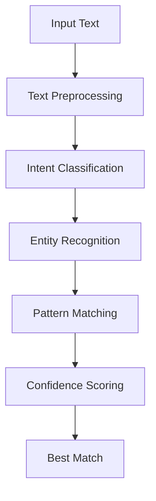

# Advanced Pattern Matching

## Overview
Implements sophisticated pattern matching using NLP techniques to understand user intent and extract relevant information.

## Architecture



## Key Components

### 1. Text Preprocessing
- Tokenization
- Lemmatization
- Stopword removal
- Special character handling

### 2. Intent Classification
- Multi-class classification of user intents
- Supports custom intent definitions
- Confidence thresholding

### 3. Entity Recognition
- Named Entity Recognition (NER)
- Custom entity extraction
- Contextual entity resolution

## Implementation Details

### Pattern Representation
```python
class Pattern:
    def __init__(self, intent, pattern, response_template, entities=None):
        self.intent = intent
        self.pattern = pattern  # Can be regex or embedding
        self.response_template = response_template
        self.entities = entities or {}
        self.confidence = 1.0
        self.usage_count = 0
```

### Matching Algorithm
1. Preprocess input text
2. Calculate similarity with known patterns
3. Extract entities based on matched patterns
4. Calculate confidence scores
5. Return best match above threshold

### Performance Optimization
- Uses FAISS for fast similarity search
- Implements caching for frequent patterns
- Batch processing for multiple patterns

## Integration with Knowledge Base


## Related Files
- `src/sifu/matcher/pattern.py`
- `src/sifu/matcher/entity_extractor.py`
- `src/sifu/matcher/intent_classifier.py`
